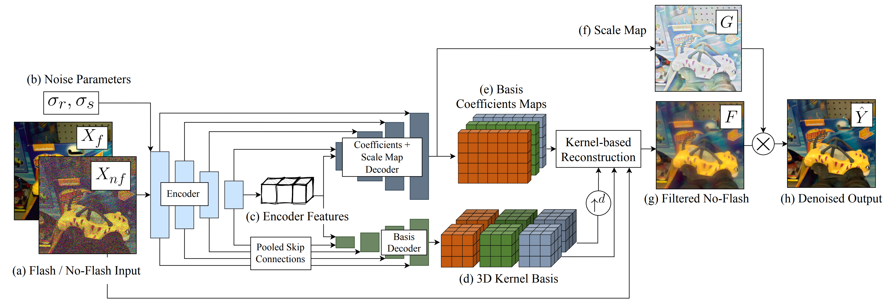

# Deep Denoising of Flash and No-Flash Pairs for Photography in Low-Light Environments
### [Project Page](https://www.cse.wustl.edu/~zhihao.xia/deepfnf/) | [Video](https://youtu.be/2n4eY66JO5s) | [Paper](https://openaccess.thecvf.com/content/CVPR2021/html/Xia_Deep_Denoising_of_Flash_and_No-Flash_Pairs_for_Photography_in_CVPR_2021_paper.html)
A Tensorflow implementation of our CVPR 2021 work on deep flash denoising.<br>

[Deep Denoising of Flash and No-Flash Pairs for Photography in Low-Light Environments](https://www.cse.wustl.edu/~zhihao.xia/bpn) (CVPR 2021) <br>
 [Zhihao Xia](https://www.cse.wustl.edu/~zhihao.xia/)<sup>1</sup>,
 [Michael Gharbi](https://www.mgharbi.com/)<sup>2</sup>,
 [Federico Perazzi](https://fperazzi.github.io/)<sup>3</sup>,
 [Kalyan Sunkavalli](https://www.kalyans.org/)<sup>2</sup>,
 [Ayan Chakrabarti](https://projects.ayanc.org/)<sup>1</sup> <br>
<sup>1</sup>WUSTL, <sup>2</sup>Adobe Research, <sup>3</sup>Facebook



## Dependencies

Python 3 + Tensorflow-1.14


## Download our testing benchmark
We generate our test set with 128 images (filenames provided in `data/test.txt`) from the raw images of the [Flash and Ambient Illuminations Dataset](http://yaksoy.github.io/faid/). The noisy and clean flash/no-flash pairs can be found [here](https://drive.google.com/file/d/1XmEQss80EyMr8e_sRRHA0u9hfrL2QZwJ/view?usp=sharing). You can also download the test set by running
```
bash ./scripts/download_testset.sh
```

## Download pre-trained model
Our pre-trained model for flash denoising can be found [here](https://drive.google.com/file/d/1YCyFFrO-X1QUk7GX2-p1jbGNix75eFvw/view?usp=sharing). You can run
```
bash ./scripts/download_models.sh
```
to download it.

## Test with pre-trained models
Run 
```
python test.py [--wts path_to_model]
```
to test flash denoising with the pre-trained model on our test set.


## Training your own models
Our model is trained on the raw images of the [Flash and Ambient Illuminations Dataset](http://yaksoy.github.io/faid/). To train your own model, download the dataset and update `data/train.txt` and `data/val.txt` with path to each image. **Note that you need to exclude images that are used in our test set (filenames provided in `data/test.txt`) from the training or val set.** 

The raw images of the [Flash and Ambient Illuminations Dataset](http://yaksoy.github.io/faid/) are in 16-bit PNG files. Exif information including the color matrix and calibration illuminant necessary for the color mapping are attached to the PNGs. To save them in pickle files for training and testing later, run
```
python dump_exif.py
```

After that, run

```
python gen_valset.py
```
to generate a validation dataset.

Finally, run

```
python train.py
```
to train the model. You can press `ctrl-c` at any time to stop the training and save the checkpoints (model weights and optimizer states). The training script will resume from the latest checkpoint (if any) in the model directory and continue training.


## Citation
If you find the code useful for your research, we request that you cite the paper. Please contact zhihao.xia@wustl.edu with any questions.
```
@InProceedings{deepfnf2021,
    author={Zhihao Xia and Micha{\"e}l Gharbi and Federico Perazzi and Kalyan Sunkavalli and Ayan Chakrabarti}
    title     = {Deep Denoising of Flash and No-Flash Pairs for Photography in Low-Light Environments},
    booktitle = {Proceedings of the IEEE/CVF Conference on Computer Vision and Pattern Recognition (CVPR)},
    month     = {June},
    year      = {2021},
    pages     = {2063-2072}
}
```


## Acknowledgments
This work was supported by the National Science Foundation under award no. [IIS-1820693](https://www.nsf.gov/awardsearch/showAward?AWD_ID=1820693). Any opinions, findings, and conclusions or recommendations expressed in this material are those of the authors, and do not necessarily reflect the views of the National Science Foundation.


## License
This implementation is licensed under the MIT License.